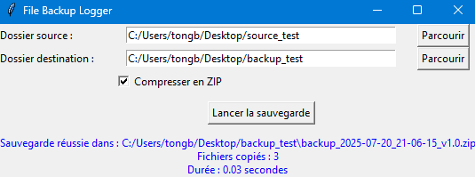
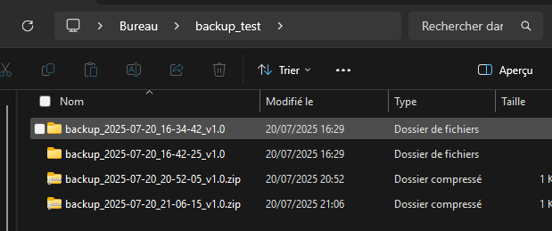
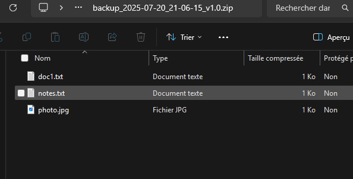

# File Backup Logger

## Description

File Backup Logger is a Python application designed to back up files and folders with automatic versioning (timestamp), local logging of operations, and a user-friendly graphical interface (GUI) built with Tkinter.

The code is written using Object-Oriented Programming (OOP) principles for modularity and maintainability.

---

## Prerequisites

- Python 3.7 or higher  
- Standard Python modules: `tkinter`, `shutil`, `zipfile`, `logging`, `json` (all included in standard Python)

---

## Installation

1. Clone the repository:

```bash
git clone https://github.com/bryan5584/file_backup_logger.git
````

2. Change into the project directory:

```bash
cd file_backup_logger
```

---

## Usage

### Command Line Interface (CLI)

Run the main script:

```bash
python main.py
```

* Enter the full path of the folder to back up.
* Enter the full path of the backup destination folder.
* Choose whether to compress the backup as ZIP (`y` for yes, `n` for no).
* The program performs the backup and displays a confirmation message with the number of files copied and duration.

#### Example

```
Path of the folder to backup: C:\Users\tongb\Desktop\source_test
Backup destination path: C:\Users\tongb\Desktop\backup_test
Do you want to compress the backup as ZIP? (y/n): y
Backup successful at: C:\Users\tongb\Desktop\backup_test\backup_2025-07-20_20-52-05_v1.0.zip
Files copied: 3
Duration: 0.06 seconds
```

---

### Graphical User Interface (GUI)

Run the GUI:

```bash
python gui.py
```

* Click **Browse** to select the source folder.
* Click **Browse** to select the destination folder.
* Check the **Compress to ZIP** box if desired.
* Click **Start Backup**.
* A message will appear indicating success or failure.

---

## Features

* Manual folder backup with automatic timestamping and versioning.
* Option to compress backups into ZIP files.
* Logging in a `backup.log` file with date, time, file count, duration, and status.
* Simple and intuitive Tkinter GUI.
* Error handling for missing folders, permissions, etc.
* User preferences saved in a `config.json` file.


---

## Screenshots

### Main Interface



---

### Backup Success Message


---

### Generated ZIP File






---

## Author

Bryan Tong – CPE Lyon - Eutech Engineers

---

## License

This project is free to use for educational purposes.

```
